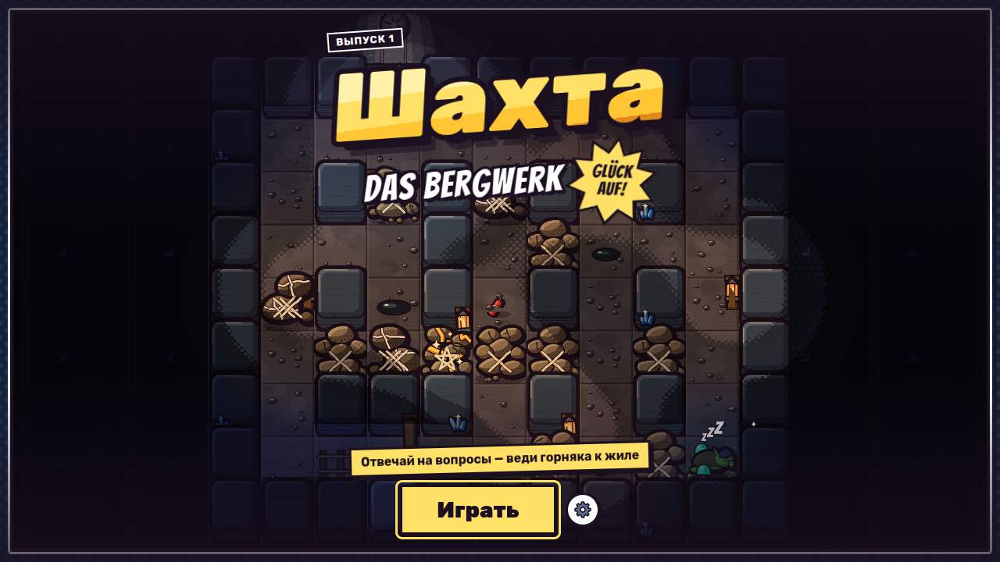
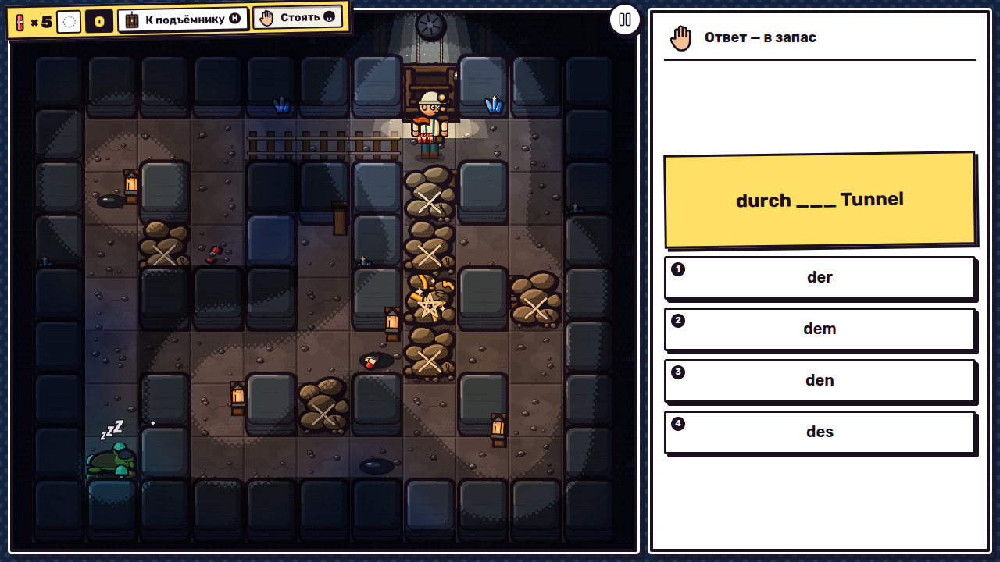
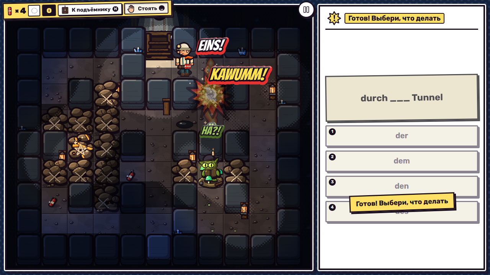
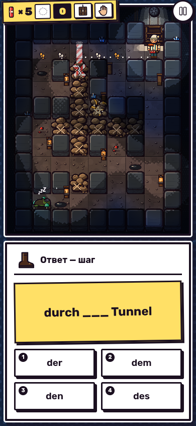

# Шахта · Das Bergwerk

Комикс-игра для тренировки немецкого: верный ответ на вопрос — шаг горняка. Ведите его к золотой жиле сквозь завалы, взрывайте породу шашками, заманивайте кобольда под взрыв и возвращайтесь к клети. Glück auf!



| Интро раунда                | Взрыв                       | Телефон                              |
| --------------------------- | --------------------------- | ------------------------------------ |
|  |  |  |

## Запуск

```bash
npm install
npm run dev        # http://localhost:5173
npm run build      # сборка в dist/
npm start          # node server.js: dist/ + генерация вопросов, порты 8080 и 3000
npm test           # правила и генератор уровней
npm run sim -- --level 1 --runs 300   # баланс ботами
```

Параметры страницы: `?level=3` — сразу в уровень, `?seed=42` — повторяемый зал, `?test` — режим сквозных тестов (только локальный банк вопросов, без сети).

`npm run dev` проксирует `/api` на `npm start` (порт 8080): чтобы в dev шли сгенерированные вопросы, держите запущенными оба.

## Вопросы: генерация из See Escape

Вопросы генерирует тот же модуль, что в See Escape, — [`quiz-generation.cjs`](quiz-generation.cjs), перенесённый без изменений: правила по каждой грамматической теме (`TOPIC_RULES`), требования к качеству заданий и формат «AUFGABEN / LOESUNGEN» с проверкой ключа. Клиент ([`src/shared/questions/QuizBankProvider.ts`](src/shared/questions/QuizBankProvider.ts)) — перенос `QuestionBank` из `see-escape/public/js/learning.js`: те же уровни A1–B2 и грамматические темы, запрос `POST /api/generate-questions` по 10 вопросов, последние задания уходят в `exclude`.

Уровень и грамматическая тема выбираются в «Настройки → Немецкий: тема заданий». Если ключ AI не задан или генерация не ответила, игра без ожидания берёт вопросы из локального банка `src/shared/questions/bank.de.json` — как See Escape берёт свой запасной пул.

Пулы и обращения к модели устроены как в See Escape:

- **на сервере** остаток пакета лежит в пуле комбинации `уровень | грамматика | лексика` (ключ без `exclude`); запрос, который пул закрывает целиком, отдаётся из него без модели, вопросы при этом изымаются; модели из `AI_MODELS` пробуются по очереди, у каждой — свой таймаут;
- **на клиенте** к модели не обращаются, пока игрок не пошёл играть (выбор уровня или старт раунда) — в меню и настройках запросов нет; пакет из 10 вопросов запрашивается, когда наготове меньше трёх;
- невыданный остаток пула (и выданный, но не отвеченный вопрос) хранится в `localStorage` сутки и только для тех же уровня и темы: после перезагрузки страницы он отдаётся сразу, без нового запроса;
- после неудачи генерация ждёт 15 с, каждая следующая неудача подряд — вдвое дольше, до двух минут; первый успех сбрасывает паузу. Ответ без новых заданий тоже считается неудачей.

## AI и голос: переменные окружения

Для генерации заданий задайте один ключ:

- `AITUNNEL_API_KEY` или `AI_TUNNEL_API_KEY` — AI Tunnel;
- `OPENAI_API_KEY` — любой OpenAI-совместимый `/chat/completions`;
- необязательно `AI_MODELS`, например `gpt-5.4` (по умолчанию — как в See Escape; через запятую — запасные модели, которые пробуются по очереди);
- необязательно `OPENAI_BASE_URL` или `AI_BASE_URL` для своего шлюза.

Озвучка ElevenLabs (`/api/tts`, `/api/generate-audio-questions` перенесены вместе с генератором):

- `ELEVENLABS_API_KEY`;
- необязательно `ELEVENLABS_VOICE_ID`, `ELEVENLABS_MODEL_ID` (по умолчанию `eleven_multilingual_v2`).

`/api/quiz/status` показывает, настроены ли генерация и озвучка, не раскрывая ключи.

## Деплой на Northflank

В репозитории есть [`Dockerfile`](Dockerfile): первый этап собирает игру (`npm ci && npm run build`), второй запускает `node server.js` на Node без `node_modules`.

1. **Create new → Service → Combined service**, подключите репозиторий и ветку.
2. **Build:** Dockerfile, build context `/`, Dockerfile path `/Dockerfile`.
3. **Run command:** оставьте пустым (Dockerfile уже запускает `node server.js`) или `npm start`. Если сервис настроен на `npm run start:northflank`, такой скрипт тоже есть — все три запускают один и тот же `node server.js`.
4. **Ports:** один порт, протокол **HTTP**, публичный. Northflank не подставляет `$PORT`, поэтому без настроек сервер слушает **и 8080, и 3000** — любой из этих номеров в port entry доходит до приложения. Для другого номера задайте `PORT` (или `PORTS` через запятую) в переменных сервиса.
5. **Health checks:** HTTP, путь `/healthz`, тот же порт, начальная задержка ~10 с.
6. **Environment variables:** ключи AI и голоса из раздела выше — как секреты. Без них сервис тоже стартует, вопросы берутся из локального банка.

Если сервис собирается не из Dockerfile, а buildpack-ом: build command `npm ci && npm run build`, run command `npm start`.

### Ошибки ingress

И `no healthy upstream`, и `upstream connect error ... Connection refused` отдаёт прокси Northflank, а не приложение. Первое значит, что живого контейнера нет вовсе; второе — контейнер поднялся, но на порту, куда стучится прокси, никто не слушает. По порядку:

1. **Контейнер вообще работает?** Service → *Observability / Logs*. Успешный старт печатает `Schtolnya listening on http://0.0.0.0:<port>`. Если лог кончается трассой или ошибкой `npm`, сборка или запуск упали.
2. **`npm error Missing script: "..."`** — run command сервиса называет скрипт, которого здесь нет. Это цикл падений: контейнер перезапускается и ни разу не отвечает. Поставьте `npm start` или оставьте поле пустым.
3. **Совпадает ли порт?** Первой строкой лог печатает, например, `Port config: PORT=(unset) PORTS=(unset) -> binding 8080, 3000`. Каждый номер в Service → *Ports* должен быть в этом списке.
4. **Health check смотрит на существующий путь?** `/healthz` (отвечает `{"ok":true}`) или `/`.
5. **0 реплик?** Сервис, свёрнутый до нуля или ещё деплоящийся, не имеет upstream: дождитесь зелёного деплоя или поставьте хотя бы 1 реплику.
6. **`Build output missing`** на `/` — запущен `node server.js` без `npm run build`.

Есть и [`render.yaml`](render.yaml) для Render, как в See Escape.

## Как играть

| Действие                 | Касание или мышь           | Клавиатура |
| ------------------------ | -------------------------- | ---------- |
| Ответить                 | кнопка варианта            | 1–4        |
| Идти / заложить шашку    | тап по проходу / по породе | стрелки    |
| К подъёмнику             | кнопка или тап по клети    | H          |
| Стоять (копить действие) | тап по герою или «Стоять»  | Пробел     |
| Пауза                    | кнопка паузы               | P, Esc     |

## Где что лежит

- `docs/mine-plan.md` — план игры, источник истины; `DECISIONS.md` — где и почему реализация от него отступает.
- `src/core/` — чистые правила без Phaser (редуктор, генератор, кобольд), покрыты тестами в `tests/`.
- `src/art/` — весь арт рисуется процедурно на Canvas 2D при загрузке; `art.html` — превью.
- `src/shared/` — общее для серии: комикс-кит, свет `ComicLightFilter`, панель вопроса, микшер звука.
- `src/audio/` — синтезированные звуки (без файлов); `audio.html` — спектрограммы пресетов.
- `src/render/`, `src/scenes/` — вид на Phaser 4; `src/ui/`, `src/app/` — экраны и поток приложения.
- `tools/` — симуляция ботами, сквозной тест (`npm run e2e`), снимки экранов (`npm run shots`).
- `server.js`, `quiz-generation.cjs` — сервер и генератор вопросов из See Escape; `Dockerfile`, `render.yaml` — деплой.

Встраивание: `mountMine(container, { questions, storage?, level?, onFinish? })` из `src/embed.ts`.
